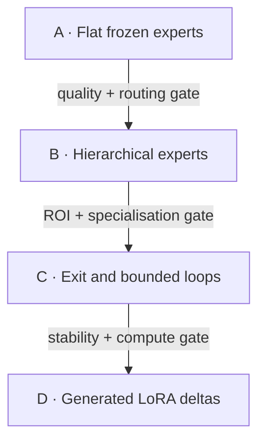

# LoRA → MoE

LoRA → MoE is an experiment-driven route from a small dense language model to
a model that grows expert-capacity only where knowledge demands it. Contributors
first train broad LoRA experts independently and route among them. A selected
expert path can then grow from X to X+1 capacity units by training one further
residual LoRA over the frozen stack. Routers at each boundary may exit to the
head, choose a sibling, or descend to another specialist. Later phases test
bounded latent-space recursion and generated LoRA weights, but only after this
progressive growth mechanism earns the right to continue.

The project is deliberately not “attach many adapters and call it an MoE.” Its
central questions are measurable:

1. Can independently trained experts preserve their specialist advantage when
   routed together?
2. Can routing beat a dense multi-task LoRA, static merging, retrieval, and an
   oracle-labelled upper bound at matched active parameters and latency?
3. When a routed path reaches its capacity, does adding a matched residual
   expert unit outperform widening, retraining, or adding a flat sibling?
4. Does a progressive hierarchy add useful capability per active byte and
   millisecond while preserving its ancestors?
5. Can a safe exit or bounded loop allocate extra latent computation without
   destabilising the pretrained representation?
6. Can a hypernetwork or diffusion model amortise expert creation while passing
   the same quality, licence, provenance, and safety gates as trained experts?

## Initial target

- Primary hardware: NVIDIA RTX 3060 12 GB.
- Portability track: Vulkan inference on Intel Meteor Lake and AMD Strix Halo
  iGPUs; native XPU/ROCm training is evaluated separately from Vulkan.
- Research stack: Python, PyTorch, Transformers, PEFT, Accelerate, and
  bitsandbytes.
- Enterprise interoperability: stable manifests and graph contracts first;
  .NET 10/TorchSharp and Microsoft Agent Framework adapters after the research
  path stabilises.
- Base-model ladder: tiny CI fixtures → 0.5–1.5B fail-fast models → 2–4B primary
  experiments → gated 7B QLoRA confirmation.

Qwen3-4B is the initial 12 GB reference candidate because it is dense,
Apache-2.0, capable enough to expose specialisation, and practical under
4-bit QLoRA. The model decision remains benchmark-controlled rather than
hard-coded.

## The sequence



Phase A trains 3–5 broad task or sector LoRAs independently, freezes them, and
trains only the root router. It compares token-, sequence-, and retrieval-based
routing, top-1 and top-2 activation, and null/base-model routing. Phase B then
selects a path from measured residual errors and trains its next LoRA on top of
the frozen ancestor stack, comparing X→X+1 growth against flat, wider, and
retrained baselines. Every later phase has an explicit stop rule in
[the experiment plan](docs/EXPERIMENT_PLAN.md).

## Run the dependency-free reference

The reference implementation exercises the contract and routing semantics
without downloading a model:

```bash
make check
make demo
```

The demo creates fixed specialist experts, trains only a softmax router, and
reports routing accuracy, task accuracy, entropy, and expert utilisation. It is
a semantic smoke test, not evidence for the language-model hypothesis.

Install the full research stack when a CUDA machine is available:

```bash
python -m venv .venv
source .venv/bin/activate
python -m pip install -e ".[research,dev]"
```

Start with `configs/phase-a-rtx3060.json`. Actual model training is the next
gated implementation slice recorded in [HANDOFF.md](docs/HANDOFF.md).

## Repository map

| Path | Purpose |
|---|---|
| `src/lora_moe/` | Dependency-free contracts and routing reference |
| `examples/` | Runnable toy proof and example expert graph |
| `schemas/` | Portable expert and graph schemas |
| `configs/` | Reproducible hardware-aware experiment profiles |
| `docs/RESEARCH.md` | Prior art, implications, and novelty boundary |
| `docs/EXPERIMENT_PLAN.md` | A → B → C → D experiments and gates |
| `docs/BENCHMARKS.md` | Quality, routing, systems, and safety scorecard |
| `docs/ECOSYSTEM.md` | Collaborative registry and compatibility design |
| `docs/ENTERPRISE.md` | Deployment, governance, and observability |
| `docs/DECISIONS.md` | Accepted, deferred, and rejected choices |
| `docs/HANDOFF.md` | Current state, evidence, and exact next actions |

Public on-demand knowledge belongs in `docs/`. Private working notes belong in
`.docs/`, which is intentionally ignored.

## Principles

- Results choose the roadmap. Novelty and expected impact influence priority;
  evidence decides continuation.
- Rejections are reversible. Record the evidence, threshold, uncertainty,
  owner, and a condition that would reopen the decision.
- “Matched expert size” means a declared capacity unit across the adapter stack,
  not LoRA rank equal to hidden width; report stored parameters, active FLOPs,
  latency, and measured marginal capability separately.
- Compare at matched active parameters, training budget, tokens, and latency.
- Separate expert quality, router quality, composition quality, and systems
  efficiency so one cannot hide another.
- Treat model, dataset, adapter, and generated-weight licences as compositional
  constraints, not free text.
- Never allow an unbounded graph cycle. “Route back” means a declared,
  budgeted loop with an exit, maximum iterations, and safety fallback.

Apache-2.0 covers repository code. Models, adapters, datasets, and generated
artifacts retain their own explicit licences and compatibility obligations.
